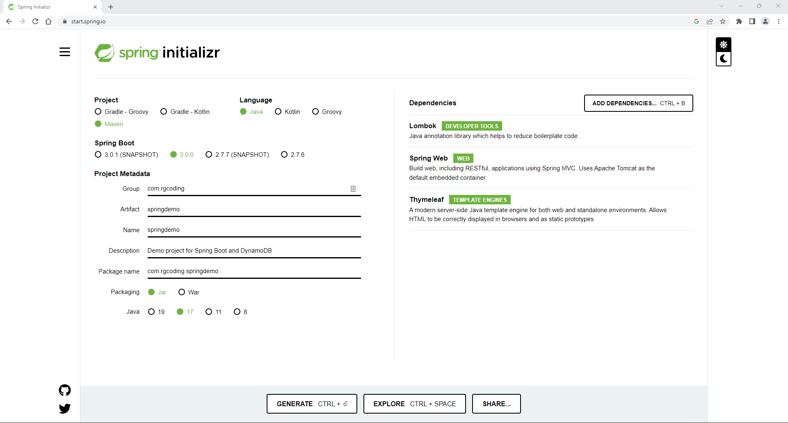

# Spring Boot and DynamoDB Demo

-----

## Steps:

-----

Requirement:

- An Amazon Web Services (AWS) Developer account
- Java Development Kit (JDK), version 17

```
sudo yum install java-17-openjdk-devel
javac -version
```

Create the project:

**NOTE** - If you have a development directory in your home directory, use that instead (e.g., ```mkdir ~/Workspace/spring-demo```, etc.).

```
mkdir ~/flask-demo
cd ~/flask-demo
git init
git branch -m main
touch README.md
wget https://raw.githubusercontent.com/github/gitignore/main/Java.gitignore -o .gitignore
wget https://raw.githubusercontent.com/github/gitignore/main/Maven.gitignore -a .gitignore
git add --all :/
git commit -m "Initial commit."
git checkout -b devel
```

Visit https://start.spring.io/ to generate your Spring Boot project. The settings will be:

Project: Maven Project
Language: Java
Spring Boot: 2.7.5 (or the most recent stable version (i.e., not a RC or snapshot))
Project Metadata:
- Group: com.qmr
- Artifact: springdemo
- Name: springdemo
- Description: Spring Boot and DynamoDB Demo
- Package name: com.qmr.springdemo
- Packaging: Jar
- Java: 17
Dependencies: Add the following dependencies:
- Lombok
- Spring Web
- Thymeleaf



Click on **GENERATE** to create the *springdemo.zip* file.

Unzip the file into a directory of your choosing:

**NOTE** - If you have a development directory in your home directory, use that instead (e.g., ```mkdir -p ~/Workspace/spring-demo```, etc.).

```
unzip ~/Downloads/springdemo.zip -d ~/spring-demo
```

Initialize the project:

```
cd ~/spring-demo
git init
git branch -m main
wget https://github.com/spring-projects/spring-boot/blob/main/.gitignore --output-document=.gitignore
git add --all :/
git commit -m "Initial commit."
git checkout -b devel
```

You will need additional dependencies. Using an editor of your choice, open **pom.xml** and, within the *<dependencies>* node, add the **AWS SDK For Java** (you can visit https://mvnrepository.com/artifact/com.amazonaws/aws-java-sdk to get the latest version):

```
<dependency>
	<groupId>com.amazonaws</groupId>
	<artifactId>aws-java-sdk</artifactId>
	<version>1.12.337</version>
</dependency>
```

If you have not done so previously, create an AWS credentials profile file on your local system:

- Linux: ```~/.aws/credentials```
- Windows: ```C:\Users\USERNAME\.aws\credentials```

Add the following lines to the file:

```
[default]
aws_access_key_id = your_access_key_id
aws_secret_access_key = your_secret_access_key
region = your_aws_region
```

>**NOTE** - while you can also hard-code your credentials in the **application.properties** file (located at ```~/spring-demo/springdemo/src/main/resources/application.properties```), [it is not recommended](https://docs.aws.amazon.com/sdk-for-php/v3/developer-guide/guide_credentials_hardcoded.html).

Add a configuration directory and class to your project:

```
mkdir - p ~/spring-demo/springdemo/src/main/java/com/qmr/springdemo/configuration
touch ~/spring-demo/springdemo/src/main/java/com/qmr/springdemo/configuration/DynamoDBConfig.java
```

Using an editor of your choice, open **DynamoDBConfig.java** and add the following code:

```

```


Also, add Sebastian J's excellent **Spring Data DynamoDB** module (you can visit https://github.com/derjust/spring-data-dynamodb to get the latest version):

```
<dependency>
    <groupId>com.github.derjust</groupId>
    <artifactId>spring-data-dynamodb</artifactId>
    <version>5.1.0</version>
</dependency>
```

REFERENCES:
https://docs.aws.amazon.com/amazondynamodb/latest/developerguide/JavaDocumentAPICRUDExample.html
https://www.baeldung.com/spring-data-dynamodb
https://spring.io/guides/gs/serving-web-content/
https://www.baeldung.com/spring-boot-start
https://datatables.net/examples/styling/bootstrap5.html